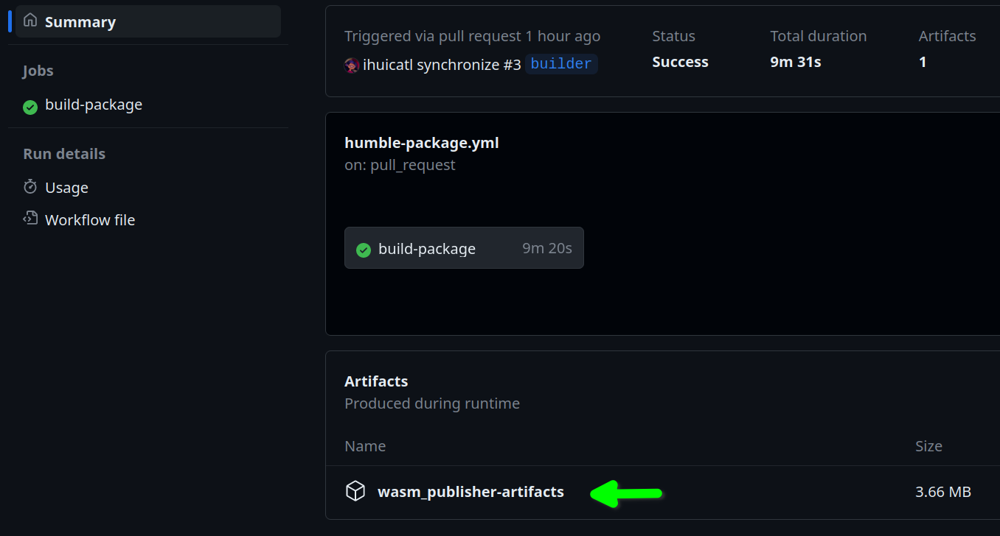

# wasm_publisher

This repo consists of a ROS 2 package containing a single publisher node. This package is cross-compiled to WebAssembly with the help of the [`ros2wasm-builder`](https://github.com/marketplace/actions/ros2wasm-builder) action.


### Example Workflow

```yaml
name: humble-package
on:
  push:
    branches: main
  pull_request:
    branches: '*'

jobs:
  build-package:
    runs-on: ubuntu-latest

    steps:
      - name: Create ROS 2 workspace
        shell: bash -eux {0}
        run: mkdir -p ros-workspace/src

      # Clone this repo (ROS package) into workspace
      - name: Checkout
        uses: actions/checkout@v3
        with:
          path: ros-workspace/src/wasm_publisher

      # Runs action and builds package
      - name: Cross-compile package
        uses: ihuicatl/ros2wasm-builder@0.1.2
        with:
          package: wasm_publisher
          ros_distro: 'humble'
          debug_mode: false
```

Once the workflow has successfully completed, the built files are available as artifacts.



### Usage

1. Copy example workflow to a repository containing your target ROS package
1. Adapt workflow example (change package name)
1. Trigger workflow with a pull request or change triggers to run manually
1. Download artifacts


**Note:** the `ros2wasm-builder` action only supports ROS 2 Humble (for now).


### Other ROS 2 packages

It is also possible to build other ROS 2 packages. The steps of the workflow would reduce to this:

```yaml
    steps:
      # Runs action and builds a different package
      - name: Cross-compile package
        uses: ihuicatl/ros2wasm-builder@0.1.2
        with:
          package: rclcpp  # new package name
          ros_distro: 'humble'
          debug_mode: false
```
